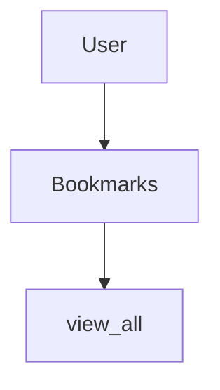

Bookmark Manager
=====

User Stories
-----
`As a user
So I can see my saved bookmarks
I would like to be able to view all bookmarks`

|  Objects        |  Messages      |
| ----------      | -------------  | 
| User |                        |
| Bookmarks |      view_all    |

Database Setup
-----

1. Connect to `psql`
2. Create the database using the `psql` command `CREATE DATABASE bookmark_manager;`
3. Connect to the database using the `pqsl` command `\c bookmark_manager;`
4. Run the query we have saved in the file `01_create_bookmarks_table.sql`